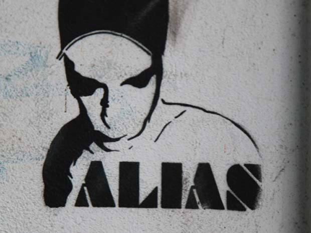

All'inizio venivano usati per divertimento perché i primi hacker erano per lo più dei ragazzini. In seguito però, questo gioco del “fingersi qualcun altro” divenne uno strumento che gli hacker potevano usare per proteggere loro stessi consentendogli di rimanere anonimi. Inizialmente, gli hacker sceglievano nomi come “Erik Bloodaxe”, “Mentor” e “Captain Crunch”. Alcuni di essi giocavano sull'ortografia delle parole come Phiber Optik. Quelli sono i nomi di alcuni dei più famosi che ora sono anche conosciuti pubblicamente. Ma questi pseudonimi erano intesi come l'identità segreta di un supereroe. Nessuno, o al massimo gli amici più stretti e fidati avrebbero dovuto conoscere lo pseudonimo usato nella rete. Perché questo bisogno di segretezza? Perché a volte la gente non capisce in che modo gli hacker sono di aiuto e chi noi siamo. Ad esempio, in passato molti studenti nella veste di hacker scoprirono vulnerabilità nelle stesse reti che usavano ogni giorno a scuola. Con l'intenzione di essere di aiuto, riportarono le loro scoperte alle amministrazioni scolastiche. In alcuni casi queste furono grate per le informazioni e forse anche per l'aiuto nel chiudere la falla. Ma si conoscono molti casi in cui lo studente venne espulso, o addirittura perseguito dal sistema scolastico. Una simile reazione deriva dall'ignoranza, ma è un qualcosa di cui dobbiamo essere al corrente e con cui dobbiamo fare i conti.

---

> Fai hacking contro tutto ma non far male a nessuno.