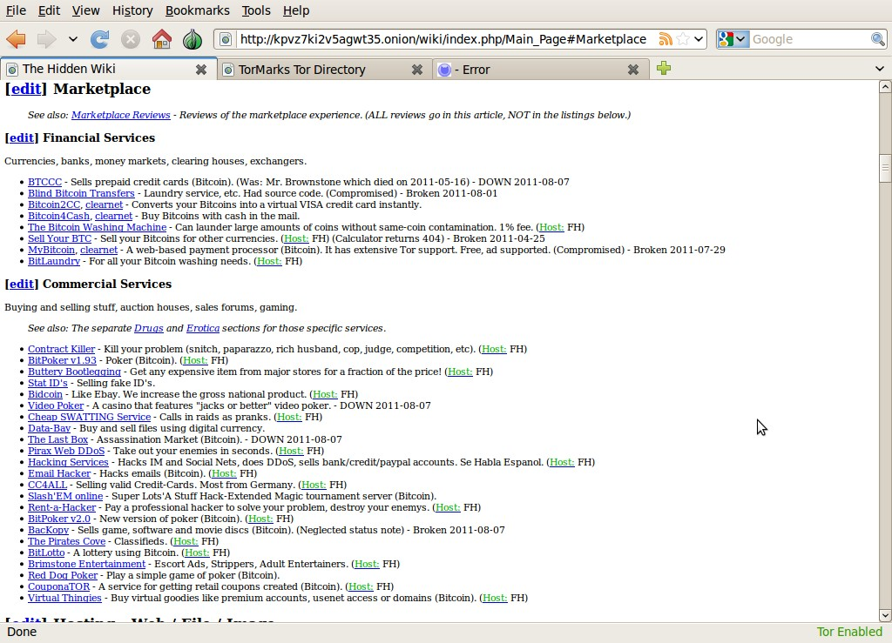

Contrapposizione naturale del cosiddetto “surface web” – i nodi della rete Internet alla portata di tutti che usiamo tutti i giorni, il deep web è la zona di Internet volontariamente tenuta nascosta dai motori di ricerca. Oggi il deep web viene principalmente usato per il traffico illegali di droghe ed armi. Non mancano luoghi in cui è possibile smerciare credenziali di carte di credito, account di diversi conosciuti servizi online (Amazon in cima alla lista), dati ed informazioni riservate, dati personali, oggetti rubati e “ferri del mestiere”, senza poi dimenticare le comunità di discussione – che esistono, oh se esistono – popolate da produttori e consumatori. Un mondo nel mondo, come succede anche nelle migliori città “perbene”. Data la sua natura, il deep web è anche quel posto in cui dissidenti, sostenitori di cause sociali ed individui simili possono scambiarsi accordi, informazioni e quant’altro sfuggendo agli occhi di censure.

---

> […] Sì, sono un criminale. Il mio crimine è la curiosità. Il mio crimine è
giudicare le persone per quello che dicono e pensano, non per il loro aspetto.
Il mio crimine è stato surclassarvi, qualcosa per cui non mi perdonerete mai.
Io sono un hacker, e questo è il mio manifesto. Potrete anche fermare me,
ma non potete fermarci tutti... dopotutto, siamo tutti uguali.
> \/\The Conscience of a Hacker/\/ by +++The Mentor+++