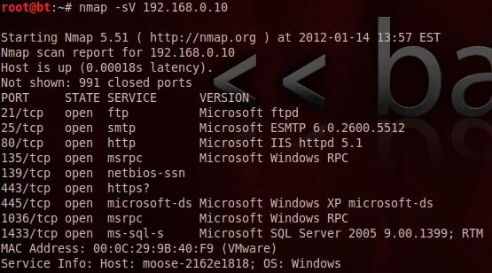

Banner grabbing is a technique used to gain information about a computer system on a network and the services running on its open ports. Administrators can use this to take inventory of the systems and services on their network. However, an intruder can use banner grabbing in order to find network hosts that are running versions of applications and operating systems with known exploits.

Some examples of service ports used for banner grabbing are those used by Hyper Text Transfer Protocol (HTTP), File Transfer Protocol (FTP), and Simple Mail Transfer Protocol (SMTP); ports 80, 21, and 25 respectively. Tools commonly used to perform banner grabbing are Telnet, nmap, zmap and Netcat.

---

> Fine, prossima attività