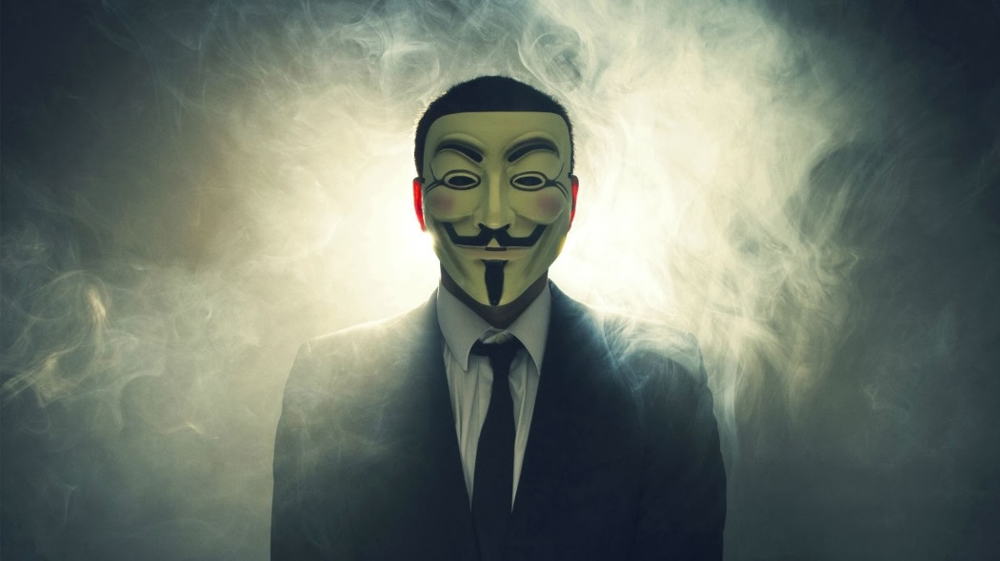

Si tende ad identificare uno sterminato gruppo di internauti, coalizzati fra loro, al fine di promuovere la libertà in rete e la guerra ad una rete cibernetica sotto controllo da parte delle superpotenze mondiali.
è un movimento che vede la libertà di pensiero ed espressione dell’utente come di fondamentale importanza e, che si è battuta più volte ricorrendo anche a metodi illegali (come l’SQL Injection e il Denial of Service) per combattere chi usava ed usa internet come mezzo non etico di guadagno personale.

---

> Hacking è ricerca. Avete mai provato a fare qualcosa tante volte, in modi differenti, fino a raggiungere il risultato che cercavate? Avete mai smontato un apparato od uno strumento per guardare come funziona, studiare i componenti ed effettuare delle modifiche per osservare le differenze nel funzionamento? Questo è hacking. Fate hacking tutte le volte che esaminate qualcosa in profondità per capire come funziona, al fine di manipolare l'oggetto ed adattarne il funzionamento alle vostre esigenze.