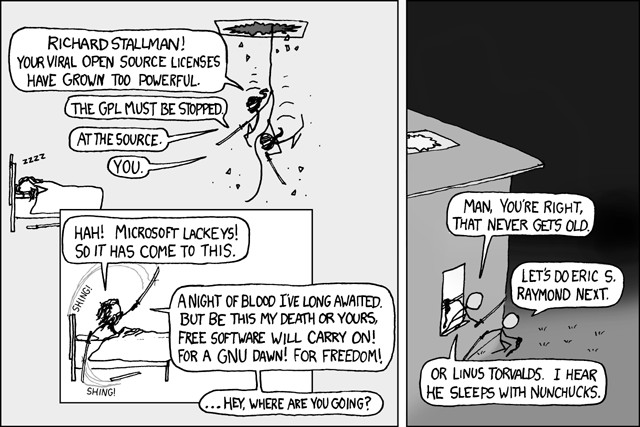

I computer [e la maggior parte dei telefoni cellulari] sono il sogno di Stalin: sono strumenti perfetti per sorvegliare, poiché possono archiviare ogni tipo di attività degli utenti. [...] La maggior parte dei telefoni cellulari trasmette la loro posizione, calcolata grazie a sistemi GPS, su richiesta da parte di sistemi remoti. La compagnia telefonica accumula un'enorme lista di luoghi dove gli utenti sono stati. Un parlamentare tedesco del partito dei Verdi ha chiesto alla compagnia telefonica di fornirgli i dati a proposito dei luoghi dove lui stesso era stato. È stato costretto a citare la compagnia, ricorrere alla giustizia per ottenere queste informazioni. E quando le ha ottenute, ha ricevuto 44.000 posizioni geografiche per un periodo di sei mesi. Si tratta di più di duecento informazioni al giorno! Ciò significa che qualcuno potrebbe creare un'ottima schedatura delle attività di una persona, semplicemente osservando questi dati.

---

> Pensate a come gli scienziati hanno mappato il genoma umano: hanno usato un metodo sviluppato per decodificare le password. Le password sono tipicamente memorizzate in forma cifrata, di modo che sia difficile rubarle. Il brute-forcing è un metodo per decifrare le password effettuando il cracking della loro forma cifrata. Questo metodo rompe l' hash delle password, decifrando pochi caratteri alla volta, mettendo tutto insieme alla fine del processo. Gli studiosi del genoma hanno utilizzato lo stesso metodo per mappare tutte le 3,3 miliardi di coppie di basi del genoma umano.