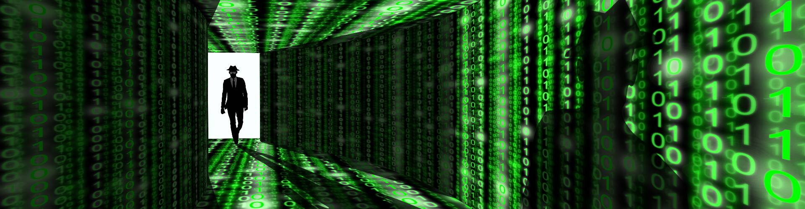

Letteralmente porta sul retro, si intende un tipo di agevolazione all’accesso di un sistema informatico. Vengono utilizzate in pirateria informatica al fine di avere accesso illecito ad un sistema operativo per poter controllare e/o manomettere la macchina del malcapitato utente.

---

> Il vero motivo per voler essere un hacker è perché conferisce molto potere. Si possono fare cose davvero interessanti quando si possiedono le capacità di un hacker di alto livello. Ogni profonda conoscenza conferisce un grande potere. Se si conosce il funzionamento di un qualcosa così profondamente da sapere come controllarlo, allora si ha un potere notevole tra le mani. Soprattutto si ha il potere di difendere se stessi e le persone care.